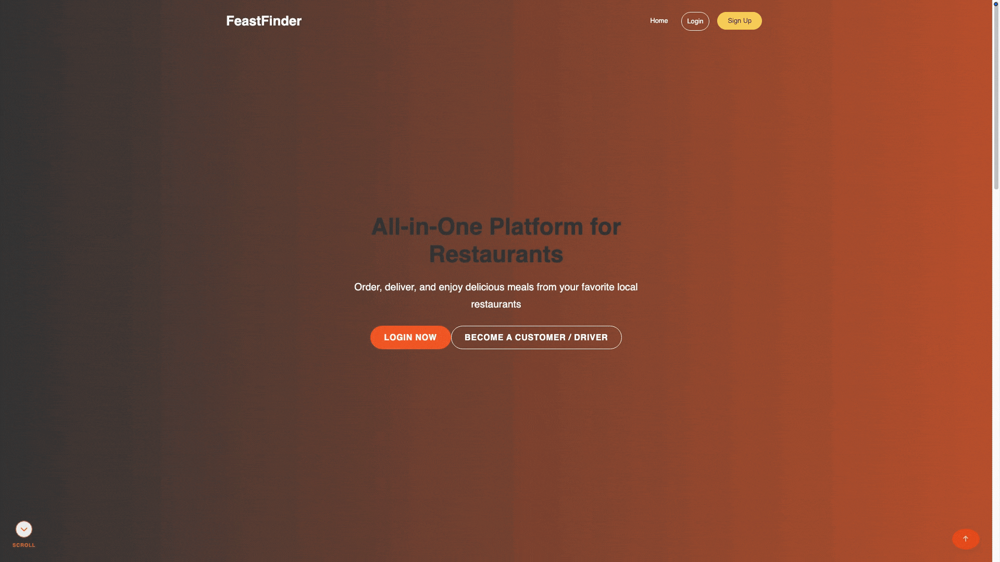

# G4T4-IS213

## FeastFinder
<p align="center">
  
</p>

Restaurant table booking with waitlist reallocation and delivery.

## Problem Statement

Restaurants face significant revenue loss due to last-minute cancellations, inefficient seat allocation, and high delivery platform commissions. There is a need for an integrated reservation and delivery management system for restaurants.

## Prerequisites

Ensure you have the following installed:

- [Node.js](https://nodejs.org/) (v16 or newer recommended)
- npm (comes with Node.js)
- [GitHub Desktop](https://desktop.github.com/) or Git CLI
- Docker
- IDE (any)


## Getting Started

Follow these steps to set up the FeastFinder application on your local machine:

### 1. Setup Environment Files
```bash
# Copy env templates
cp backend/.env.example backend/.env
cp backend/supabase/.env.example backend/supabase/.env
cp frontend/.env.example frontend/.env
```

### 2. Option A: Native Local Stack (Recommended for Dev)
Launch the entire stack (Supabase, 17 microservices, Kong Gateway, RabbitMQ, and Frontend with **Vite Hot-Module-Reloading**):
```bash
docker compose up -d
```
The application will be available at [http://localhost:5173](http://localhost:5173).

### 3. Option B: Production Containerized Mode (Caddy Web Server)
Launch the hardened production stack (Multi-stage Caddy container for frontend, zero Node.js runtime, restricted admin ports):
```bash
docker compose -f docker-compose.yaml -f docker-compose.prod.yaml up -d
```
The production application will be available at [http://localhost:8080](http://localhost:8080).

---

### Access Points
| Service | Local Dev URL | Production Container URL |
|---------|---------------|--------------------------|
| Frontend UI | http://localhost:5173 (Vite HMR) | http://localhost:8080 (Caddy) |
| Kong API Gateway | http://localhost:8000 | http://localhost:8000 |
| Supabase Studio | http://localhost:3000 | Disabled (N/A) |
| Supabase API | http://localhost:8100 | http://localhost:8100 |
| RabbitMQ Console | http://localhost:15672 (guest/guest) | http://localhost:15672 |

### Stop All Services
```bash
# Stop local dev stack:
docker compose down

# Stop production stack:
docker compose -f docker-compose.yaml -f docker-compose.prod.yaml down
```

## Technical Architecture Diagram


## Frameworks and Databases Utilised
<p align="center"><strong>Microservices and UI</strong></p>
<p align="center">
<a href="https://vitejs.dev/"></a>&nbsp;&nbsp;
<a href="https://vuejs.org/"></a>&nbsp;&nbsp;
<a href="https://developer.mozilla.org/en-US/docs/Web/JavaScript"></a>&nbsp;&nbsp;
<a href="https://www.python.org/"></a>&nbsp;&nbsp;
<a href="https://flask.palletsprojects.com/"></a>&nbsp;&nbsp;
<a href="https://supabase.com/"></a>&nbsp;&nbsp;
<br>
<i>Vite · Vue · JavaScript · Python · Flask · Supabase Auth</i>
</p>
<br>

<p align="center"><strong>Low Code Platform</strong></p>
<p align="center">
<a href="https://www.outsystems.com/"></a>
<br>
<i>outsystems</i>
</p>
<br> 

<p align="center"><strong>External API</strong></p>  
<p align="center">
<a href="https://maps.google.com/"></a>&nbsp;&nbsp;
<a href="https://stripe.com/"></a>&nbsp;&nbsp;
<a href="https://resend.com/"></a>&nbsp;&nbsp;
<a href="https://openstreetmap.com/"></a>&nbsp;&nbsp;
<br>
<i>Google Maps API · Stripe · Resend Email · Open Street Map</i>
</p>
<br>

<p align="center"><strong>Storage Solutions</strong></p>  
<p align="center">
<a href="https://supabase.com/"></a>&nbsp;&nbsp;
<br>
<i>Supabase</i>
</p>
<br> 

<p align="center"><strong>Message Brokers</strong></p>
<p align="center">
<a href="https://www.rabbitmq.com/"></a>
<br>
<i>rabbitMQ</i>
</p>
<br> 

<p align="center"><strong>Inter-service Communications</strong></p>
<p align="center">
<a href="https://restfulapi.net/"></a>
<br>
<i>REST API</i>
</p> 
<br>

<p align="center"><strong>API Gateway</strong></p>
<p align="center">
<a href="https://konghq.com/"></a>
<br>
<i>Kong</i>
</p>
<br> 

<p align="center"><strong>Deployment & Containerization</strong></p>
<p align="center">
<a href="https://github.com/"></a>&nbsp;&nbsp;
<a href="https://www.docker.com/"></a>&nbsp;&nbsp;
<a href="https://containrrr.dev/watchtower/"></a>&nbsp;&nbsp;
<a href="https://caddyserver.com/"></a>&nbsp;&nbsp;
</p>
<p align="center">
<i>Github Actions· Docker Compose · Watchtower · Caddy</i>
</p>
<br> 

> [!NOTE]
> **Submitted Project Snapshot:** The original project submission for evaluation is preserved in the [`submitted-project`](https://github.com/WeiShenL/G4T4-IS213/tree/submitted-project) branch (`git checkout submitted-project`).
> 
> **Post Submission Improvements:**
> - **Local Self-Hosted Supabase**: Full Docker setup with Supabase Realtime for live order & driver dashboard updates.
> - **Real-Time Live Dashboards**: Instant WebSocket updates via Supabase Realtime for Customer & Driver dashboards (no manual page refreshes needed).
> - **Native Waitlist Microservice**: Replaced OutSystems with custom Python microservice & decline reallocation workflow.
> - **Resend Email Service**: Integrated Resend API for transactional notifications, instead of paid Twilio SMS API.
> - **Production VPC Ready**: Docker containerization, including Frontend and Backend for both local and prod environments. WatchTower will be used to fetch latest push to main to update containers for production.